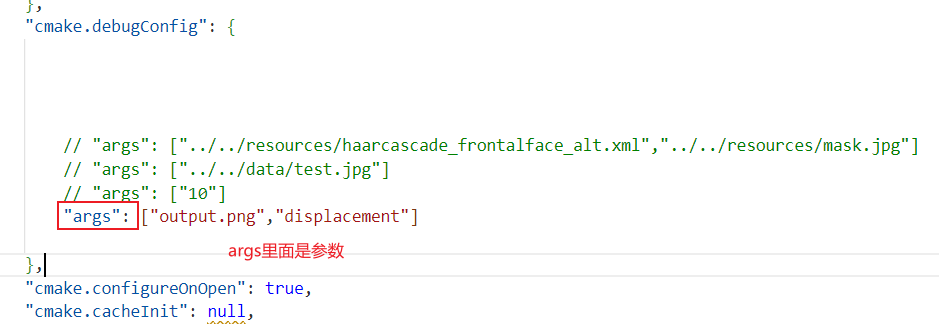

# 配置
## 环境配置

除了llvm的环境已经配置好了。不用安装，直接可以运行。

## 代码调试

代码需要一个输入参数才能运行，这个输入参数是测试文件的路径。如果给的是相对路径的话，是相对于build文件的

> 比如我要测试test文件夹下的exp_example.c1文件，那么输入的参数为../test/exp_example.c1

调试可以用vscode的cmake工具，先config,然后build,最后运行或调试

> 1.config，2.build 3.运行和调试

> 注意调试的时候需要在setting里面设置输入参数，默认没有参数。设置方法如下：
>
> 1.点击vscode的File，然后选择reference的setting
>
> 
>
> 2.找到cmake拓展的Debug选项：
>
> 
>
> 3.设置对应的参数：
>
> 